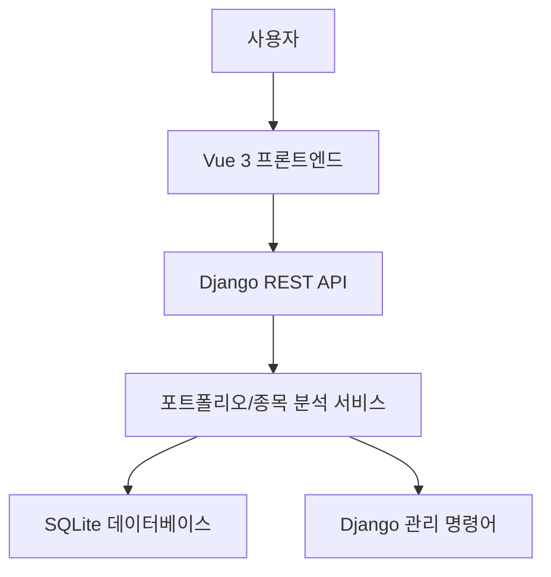

# AlphaPick 문서 인덱스

이 폴더는 AlphaPick의 요구사항, 화면 설계, 아키텍처, 품질 검증, 발표 자료를 정리한 문서 모음입니다. 모든 마크다운 문서는 현재 구현 기준으로 한글로 작성합니다.

## 현재 제품 구조

AlphaPick은 국내 주식 데이터를 기반으로 종목 점수를 계산하고, 투자 성향별 허들을 통과한 종목으로 오늘의 알파 포트폴리오를 구성합니다.

현재 사용자 화면은 다음 흐름을 기준으로 합니다.

1. 기본 대시보드 홈에서 시장 지표와 편입 종목 TOP 15 확인
2. 오늘의 포트폴리오에서 편입 종목 전체 확인
3. 종목 검색에서 분석 대상 탐색
4. 종목 리포트에서 차트, 점수, 지표, 뉴스, AI 코멘트 확인
5. 커뮤니티에서 종목별 의견 확인

백테스트 화면은 현재 프론트엔드 사용자 화면에서 제거되었습니다.

## 문서 목록

- [PRD.md](PRD.md): 제품 요구사항 정의서
- [recommendation_requirements.md](recommendation_requirements.md): 추천 포트폴리오 정책 명세
- [WIREFRAME.md](WIREFRAME.md): 화면 와이어프레임
- [UML.md](UML.md): 유스케이스, ERD, 시퀀스 다이어그램
- [WBS_GANTT.md](WBS_GANTT.md): 작업 분해 및 일정
- [QA.md](QA.md): 품질 검증 체크리스트
- [ARCHITECTURE_CLEANUP.md](ARCHITECTURE_CLEANUP.md): 아키텍처 정리 내역
- [PRESENTATION_SCRIPT.md](PRESENTATION_SCRIPT.md): 발표 대본

## 핵심 아키텍처



## 주요 도메인 모델

- `Stock`: 종목 기본 정보
- `PriceDaily`: 일별 가격과 기술 지표
- `FinancialMetric`: 재무 지표
- `ScoreSnapshot`: 종목별 일자별 점수 스냅샷
- `PortfolioRun`: 특정 기준일의 포트폴리오 실행 결과
- `PortfolioItem`: 포트폴리오에 편입된 개별 종목과 비중
- `AICommentCache`: 종목 AI 코멘트 캐시

## 실행 검증 요약

```powershell
cd backend
.\.venv\Scripts\python.exe manage.py check
.\.venv\Scripts\python.exe manage.py test stocks

cd ..\frontend
npm run build
```
