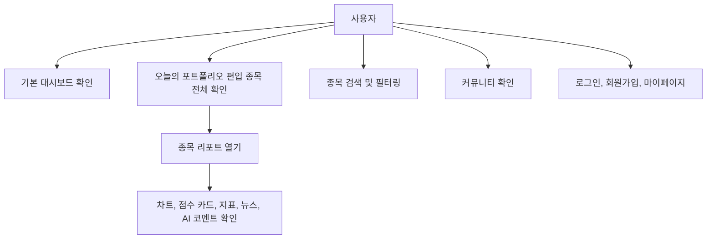
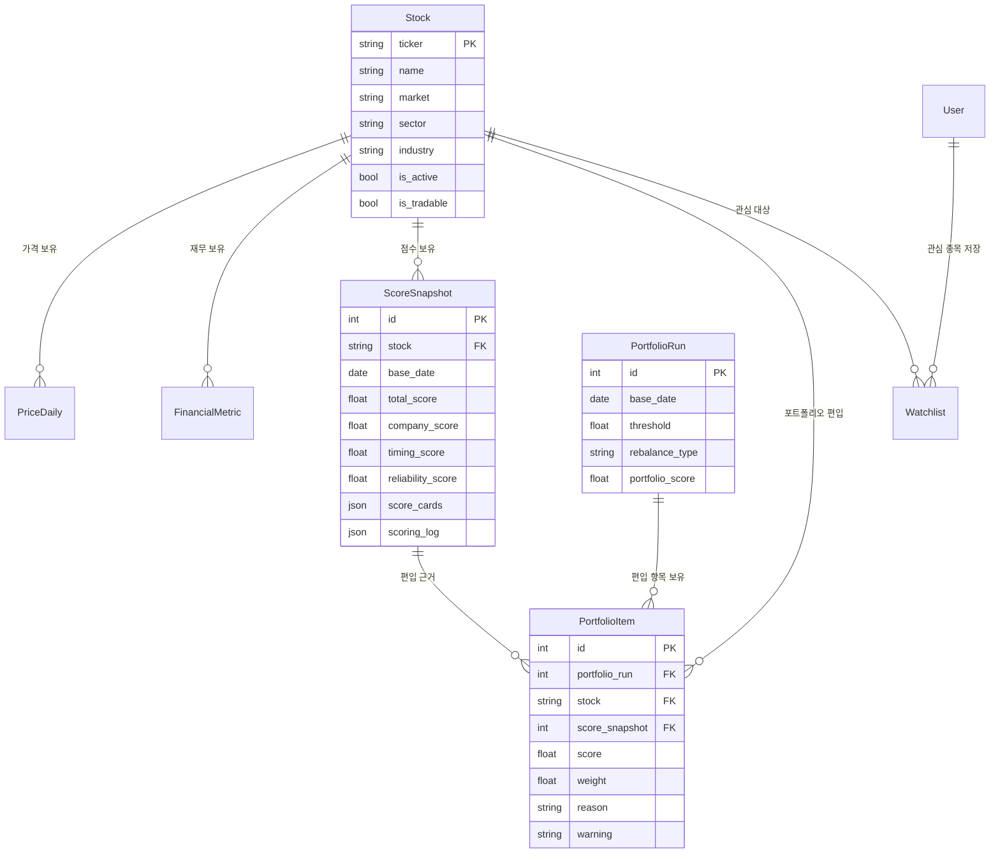
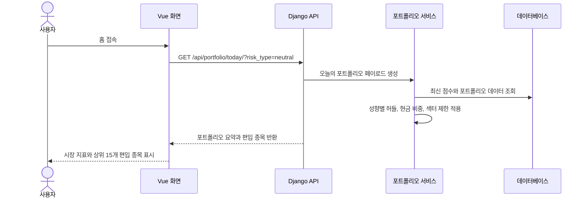
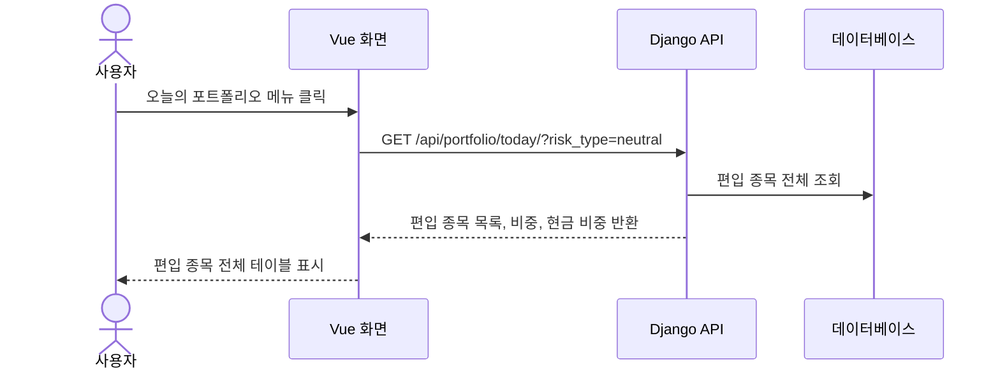

# UML 다이어그램

## 유스케이스

```mermaid
flowchart TD
  User["사용자"] --> Home["기본 대시보드 확인"]
  User --> Portfolio["오늘의 포트폴리오 편입 종목 전체 확인"]
  Portfolio --> Report["종목 리포트 열기"]
  Report --> Analysis["차트, 점수 카드, 지표, 뉴스, AI 코멘트 확인"]
  User --> Search["종목 검색 및 필터링"]
  User --> Community["커뮤니티 확인"]
  User --> Auth["로그인, 회원가입, 마이페이지"]
```

## ERD

```mermaid
erDiagram
  Stock ||--o{ PriceDaily : "가격 보유"
  Stock ||--o{ FinancialMetric : "재무 보유"
  Stock ||--o{ ScoreSnapshot : "점수 보유"
  PortfolioRun ||--o{ PortfolioItem : "편입 항목 보유"
  Stock ||--o{ PortfolioItem : "포트폴리오 편입"
  ScoreSnapshot ||--o{ PortfolioItem : "편입 근거"
  User ||--o{ Watchlist : "관심 종목 저장"
  Stock ||--o{ Watchlist : "관심 대상"

  Stock {
    string ticker PK
    string name
    string market
    string sector
    string industry
    bool is_active
    bool is_tradable
  }

  ScoreSnapshot {
    int id PK
    string stock FK
    date base_date
    float total_score
    float company_score
    float timing_score
    float reliability_score
    json score_cards
    json scoring_log
  }

  PortfolioRun {
    int id PK
    date base_date
    float threshold
    string rebalance_type
    float portfolio_score
  }

  PortfolioItem {
    int id PK
    int portfolio_run FK
    string stock FK
    int score_snapshot FK
    float score
    float weight
    string reason
    string warning
  }
```

## 시퀀스: 기본 대시보드 조회

```mermaid
sequenceDiagram
  actor User as 사용자
  participant Vue as Vue 화면
  participant API as Django API
  participant Service as 포트폴리오 서비스
  participant DB as 데이터베이스

  User->>Vue: 홈 접속
  Vue->>API: GET /api/portfolio/today/?risk_type=neutral
  API->>Service: 오늘의 포트폴리오 페이로드 생성
  Service->>DB: 최신 점수와 포트폴리오 데이터 조회
  Service->>Service: 성향별 허들, 현금 비중, 섹터 제한 적용
  API-->>Vue: 포트폴리오 요약과 편입 종목 반환
  Vue-->>User: 시장 지표와 상위 15개 편입 종목 표시
```

## 시퀀스: 오늘의 포트폴리오 전체 조회

```mermaid
sequenceDiagram
  actor User as 사용자
  participant Vue as Vue 화면
  participant API as Django API
  participant DB as 데이터베이스

  User->>Vue: 오늘의 포트폴리오 메뉴 클릭
  Vue->>API: GET /api/portfolio/today/?risk_type=neutral
  API->>DB: 편입 종목 전체 조회
  API-->>Vue: 편입 종목 목록, 비중, 현금 비중 반환
  Vue-->>User: 편입 종목 전체 테이블 표시
```
