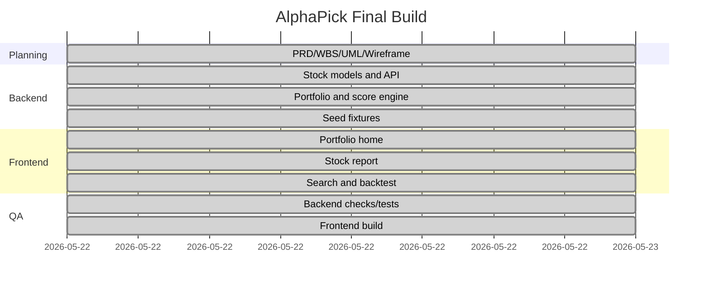

# WBS and Gantt

## WBS

| Level | Task | Output |
|---|---|---|
| 1 | AlphaPick MVP | Final portfolio recommendation service |
| 2 | Planning | PRD, WBS, UML, wireframe |
| 3 | Product policy | 70-point threshold, daily rebalance, excess-score-weighted portfolio |
| 3 | Data design | stock, price, metric, score, portfolio entities |
| 2 | Backend | Django/DRF stock recommendation APIs |
| 3 | Models | `Stock`, `PriceDaily`, `FinancialMetric`, `ScoreSnapshot`, `PortfolioRun`, `PortfolioItem`, `Watchlist` |
| 3 | Seed data | `seed_alphapick --flush` |
| 3 | Portfolio engine | threshold filtering, score weights, watch candidates |
| 3 | Backtest | MVP series vs KOSPI |
| 2 | Frontend | Vue 3 presentation UI |
| 3 | Home | today's alpha portfolio |
| 3 | Stock report | score report based on the reference image |
| 3 | Search | stock list and score filter |
| 3 | Backtest | portfolio vs benchmark chart |
| 2 | QA | final tests and API smoke checks |

## Gantt

