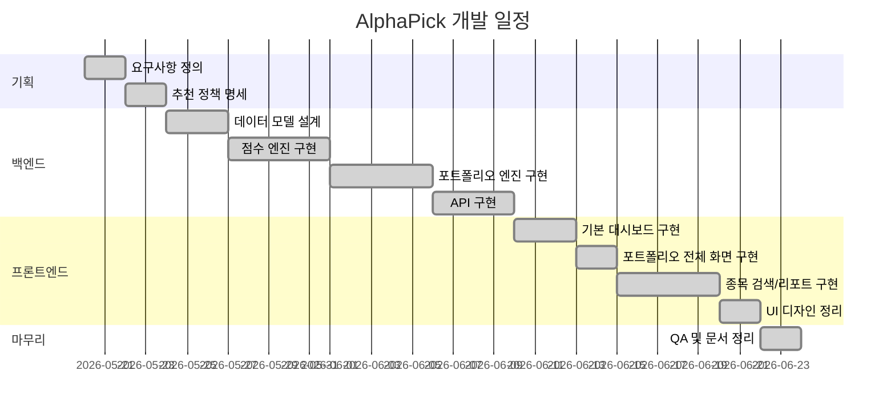

# WBS 및 일정

## 작업 분해

| 단계 | 작업 | 산출물 |
|---|---|---|
| 1 | 요구사항 정의 | PRD, 추천 정책 명세 |
| 2 | 데이터 모델 설계 | Stock, PriceDaily, ScoreSnapshot, Portfolio 모델 |
| 3 | 점수 엔진 구현 | 회사 점수, 타이밍 점수, 신뢰도 점수 |
| 4 | 포트폴리오 엔진 구현 | 성향별 허들, 현금 비중, 섹터 제한 |
| 5 | API 구현 | 포트폴리오, 종목, 리포트, AI 코멘트 API |
| 6 | 기본 대시보드 구현 | 시장 지표 스트립, 편입 종목 상위 15개 |
| 7 | 오늘의 포트폴리오 화면 구현 | 편입 종목 전체 테이블 |
| 8 | 종목 검색 및 리포트 구현 | 검색, 상세 차트, 점수 카드, 지표 |
| 9 | 사용자 기능 구현 | 로그인, 회원가입, 마이페이지, 관심 종목 |
| 10 | UI 정리 | 네이비/민트 금융 대시보드 디자인 |
| 11 | QA | 백엔드 검사, 프론트 빌드, API 스모크 테스트 |
| 12 | 발표 준비 | 발표 대본, 시연 흐름, 문서 정리 |

## 간트 차트

